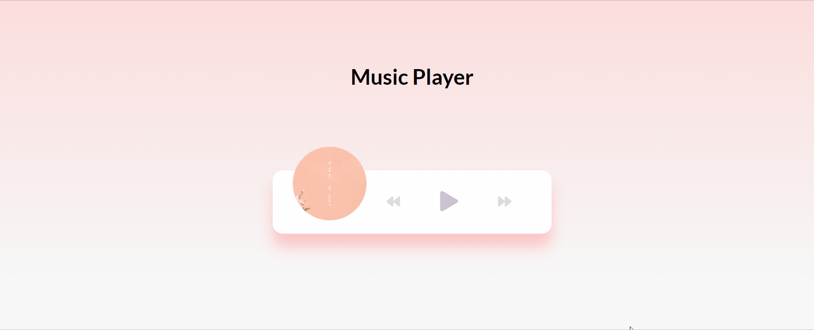

<h1 align="center">Music Player</h1>

    I am starting to learn javascript by myself, besides what I have been learning about this language programming in my university. 
       
    According to this, I decide start making some projects to improve my knowledges, which the one of them is my <strong>Music Player Javascript Project</strong>.

<h2>Technologies</h2>

 
    I developed this project using:

<ul>
    <li>HTML </li>
    <li> CSS </li>
    <li> JAVASCRIPT </li>
</ul>

